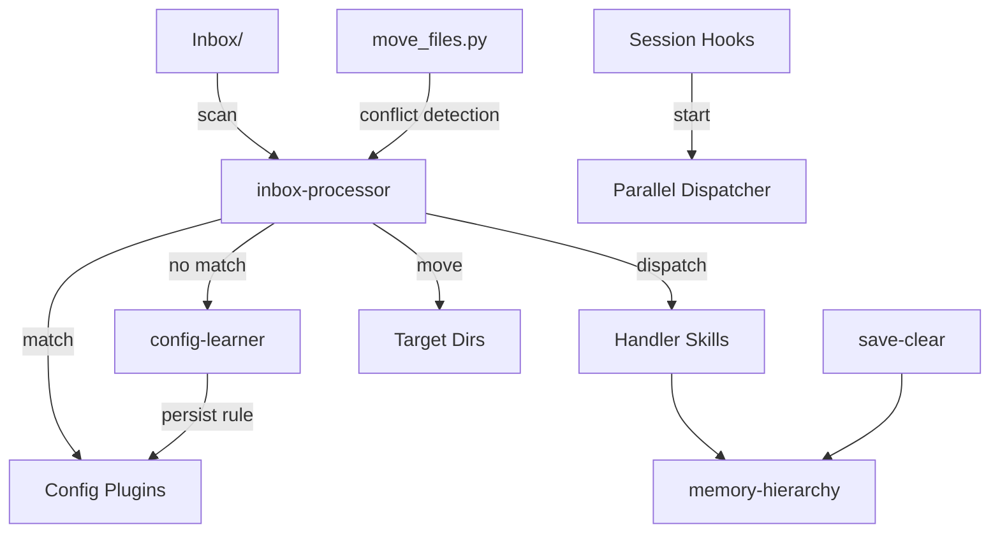

# AgentKit

A config-driven skill framework for [Claude Code](https://claude.ai/claude-code) — intelligent file routing, self-learning rules, structured memory, and session lifecycle management.

```
Inbox/ → [inbox-processor] → match plugins → dispatch/move → clean
                ↓ no match
         [config-learner] → persist new rule → next time auto-match
```

## What It Does

AgentKit provides a set of reusable **skills** (prompt-based capabilities) for Claude Code that turn your knowledge base into an automated knowledge management system:

- **inbox-processor** — Config-driven file router. Drop files into `Inbox/`, and plugins match them by filename, regex, extension, or content hints, then dispatch to handler skills or move to target directories.
- **config-learner** — Runtime rule learning. When inbox encounters an unknown file, it asks you once, then remembers the rule forever.
- **memory-hierarchy** — Structured memory management. Scans diary/inbox for TODOs, maintains decisions, preferences, lessons, and project records with semantic deduplication.
- **save-clear** — Session lifecycle. Exports conversations to your knowledge base before clearing context, with automatic memory extraction.

Plus reusable **agent templates** (researcher, coder, checker) and **session hooks** for startup/shutdown automation.

## Architecture



### Design Patterns

| Pattern | Where | What |
|---------|-------|------|
| **Config-driven routing** | inbox-processor | JSON plugins with priority, match criteria, actions |
| **Self-learning** | config-learner | User decisions auto-persist as new plugin rules |
| **Conflict-aware file ops** | move_files.py | Auto-resolves duplicates/supersets, flags diverged content |
| **Structured memory** | memory-hierarchy | Atomic entries with semantic dedup |
| **Session lifecycle** | hooks/ | Parallel startup scripts, conversation export |

See [ARCHITECTURE.md](ARCHITECTURE.md) for detailed design documentation.

## Quick Start

```bash
# 1. Clone
git clone https://github.com/youruser/agentkit.git
cd agentkit

# 2. Install
chmod +x setup.sh
./setup.sh

# 3. Test — drop a file into your knowledge base's Inbox/, then in Claude Code:
/inbox-processor
```

The setup script will:
- Ask for your knowledge base path
- Symlink skills to `~/.claude/skills/`
- Create config files from examples
- Optionally install agent templates and hooks

## Plugin System

Plugins are JSON objects that define how files get matched and routed:

```json
{
  "name": "meeting-notes",
  "priority": 20,
  "filename_regex": "\\d{4}-\\d{2}-\\d{2}.*meeting",
  "extension": [".md"],
  "content_hints": ["attendees", "action items", "agenda"],
  "tags": ["meetings"],
  "move_to": "Meetings/"
}
```

**Match logic** (short-circuit, first match wins):
1. `filename_contains` → keyword match (fast path)
2. `filename_regex` → regex on filename
3. `extension` → filter by file type
4. `content_hints` → OCR images, read PDFs/markdown for patterns

**Actions**: `move_to` (file routing), `handler_skill` (invoke another skill), or `actions` array (multi-step).

See [examples/inbox-plugins/](examples/inbox-plugins/) for pre-built configs for different personas.

## Project Structure

```
agentkit/
├── _shared/                    # Shared infrastructure
│   ├── user_config.py          # 3-layer config loader
│   ├── move_files.py           # Conflict-aware file mover
│   └── moc_builder.py          # MOC generator
├── skills/                     # Core skills
│   ├── inbox-processor/        # File routing engine
│   ├── config-learner/         # Runtime rule learning
│   ├── memory-hierarchy/       # Structured memory
│   └── save-clear/             # Session export + memory update
├── agents/                     # Agent templates
│   ├── researcher.md           # Focused Q&A research
│   ├── coder.md                # TDD implementation
│   └── checker.md              # Code review (read-only)
├── hooks/                      # Session lifecycle
│   └── session-start-dispatcher.py
├── examples/                   # Pre-built configs
└── docs/                       # Documentation
```

## Configuration

Three-layer config resolution (each layer overrides the previous):

1. **Framework defaults** — `_shared/user_config.py` `DEFAULT_CONFIG`
2. **User config** — `_shared/user-config.json` (gitignored, created from example)
3. **Local overrides** — `_shared/user-config.local.json` (machine-specific)

```json
{
  "paths": {
    "vault_root": "~/MyVault",
    "inbox_folder": "Inbox"
  },
  "automation": {
    "auto_refresh_indexes": true,
    "git_commit": false
  }
}
```

## Writing Your Own Plugins

1. Add a plugin entry to `~/.claude/skills/inbox-processor/config.json`
2. Or let config-learner do it — just drop an unmatched file and tell Claude how to handle it
3. For complex processing, create a handler skill and reference it via `handler_skill`

See [docs/writing-custom-plugins.md](docs/writing-custom-plugins.md) for the full guide.

## Requirements

- [Claude Code](https://claude.ai/claude-code) CLI or desktop app
- Python 3.10+
- A knowledge base directory (e.g., Obsidian vault or any directory structure)

## License

MIT — see [LICENSE](LICENSE).
