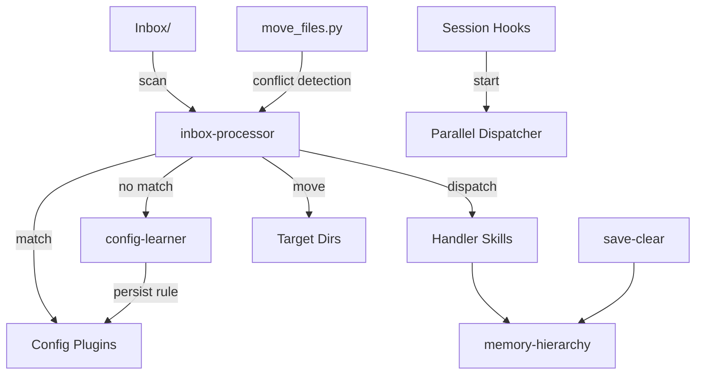

# AgentKit

A file routing system for [Claude Code](https://claude.ai/claude-code) that learns your rules as you use it.

You tell it once where something should go. Next time, it just does it.

```
Inbox/ → [inbox-processor] → match plugins → dispatch/move → clean
                ↓ no match
         ask you → [config-learner] → save rule → next time auto-match
```

## Why This Exists

I dump a lot of stuff into my knowledge base every day — voice memo transcripts, screenshots, PDFs, meeting notes, random thoughts. They all land in `Inbox/` and sit there until I sort them manually.

So I built a system: drop files in, run one command, everything routes itself. When it sees something new, it asks me where it should go, then remembers the answer. After a couple weeks of this, 95%+ of my files route automatically.

The core idea: **you shouldn't have to organize the same kind of file twice**. Tell the system once, it handles the rest.

This grew out of my daily Claude Code workflow — I wanted something that actually gets smarter with use, not just a static script. The whole thing is config-driven, so you can adapt it to whatever your own workflow looks like.

## What's Inside

- **inbox-processor** — The main thing. Scans your Inbox, matches files against plugin rules (by filename, regex, extension, or content), then moves them or hands them off to other skills. Supports OCR for images, text extraction for docx/xlsx/pptx.
- **config-learner** — When inbox hits an unknown file, you tell it what to do, it writes the rule to config.json. You never answer the same question twice.
- **memory-hierarchy** — Keeps track of your decisions, lessons learned, and TODOs across sessions. Scans your diary and inbox for new items, deduplicates against what's already recorded.
- **save-clear** — Exports your conversation to your knowledge base before clearing context. Also extracts any decisions or lessons worth keeping.

Plus **agent templates** (researcher, coder, checker) and **session hooks** for startup/shutdown automation.

## Architecture



### How the pieces fit together

| Pattern | Where | What it does |
|---------|-------|-------------|
| **Config-driven routing** | inbox-processor | JSON plugins with priority, match criteria, actions |
| **Self-learning** | config-learner | Your decisions auto-persist as new rules |
| **Conflict-aware moves** | move_files.py | Detects duplicates and supersets, flags real conflicts |
| **Structured memory** | memory-hierarchy | Atomic entries, semantic dedup, append-only |
| **Session lifecycle** | hooks/ | Parallel startup scripts, conversation export |

More detail in [ARCHITECTURE.md](ARCHITECTURE.md).

## Quick Start

```bash
git clone https://github.com/VanK33/Knowledge-Base-Kit.git
cd Knowledge-Base-Kit
chmod +x setup.sh
./setup.sh
```

The setup asks for your knowledge base path, symlinks everything to `~/.claude/skills/`, and creates config files from the examples.

Then drop a file into your Inbox and run `/inbox-processor` in Claude Code.

## Real Example

Say your Inbox has three files:
- `2026-03-30-standup.md` — matched by `filename_regex` → moves to `Meetings/`
- `Q1-report.pdf` — matched by `content_hints` (finds "quarterly revenue" inside) → moves to `Reports/`
- `random-screenshot.png` — no match → OCR reads the image, still no match → asks you → you say "Screenshots/" → config-learner saves the rule

Next time a `.png` shows up with similar content, it goes to `Screenshots/` automatically.

## Plugin System

Plugins are just JSON. Here's what one looks like:

```json
{
  "name": "meeting-notes",
  "priority": 20,
  "filename_regex": "\\d{4}-\\d{2}-\\d{2}.*meeting",
  "extension": [".md"],
  "content_hints": ["attendees", "action items", "agenda"],
  "move_to": "Meetings/"
}
```

Match logic is short-circuit — first match wins:
1. `filename_contains` → keyword hit in the filename
2. `filename_regex` → regex on filename
3. `extension` → file type filter
4. `content_hints` → actually reads the file (OCR for images, text extraction for Office docs)

You can write plugins by hand, or just let config-learner build them for you as you go.

Pre-built configs for different workflows: [examples/inbox-plugins/](examples/inbox-plugins/)

## Project Structure

```
agentkit/
├── _shared/                    # Shared infra
│   ├── user_config.py          # 3-layer config loader
│   ├── move_files.py           # Conflict-aware file mover
│   ├── extract_text.py         # Text extraction (docx/xlsx/pptx)
│   └── moc_builder.py          # Directory index generator
├── skills/                     # Core skills
│   ├── inbox-processor/        # File routing engine
│   ├── config-learner/         # Runtime rule learning
│   ├── memory-hierarchy/       # Structured memory
│   └── save-clear/             # Session export + memory update
├── agents/                     # Agent templates
├── hooks/                      # Session lifecycle
├── examples/                   # Pre-built configs
└── docs/                       # Documentation
```

## Configuration

Three layers, each overrides the previous:

1. **Defaults** in `user_config.py` — sensible out of the box
2. **Your config** in `user-config.json` — your paths, your preferences
3. **Local overrides** in `user-config.local.json` — machine-specific stuff

```json
{
  "paths": {
    "vault_root": "~/MyKnowledgeBase",
    "inbox_folder": "Inbox"
  },
  "automation": {
    "auto_refresh_indexes": true,
    "git_commit": false
  }
}
```

## Docs

- [Getting Started](docs/getting-started.md) — install → first inbox run
- [Config Reference](docs/config-reference.md) — every option explained
- [Writing Custom Plugins](docs/writing-custom-plugins.md) — plugin schema and match logic
- [Skill Development Guide](docs/skill-development-guide.md) — build your own skills

## Requirements

- [Claude Code](https://claude.ai/claude-code)
- Python 3.10+
- Any directory you want to organize (Obsidian vault, plain folders, whatever)

## License

MIT
