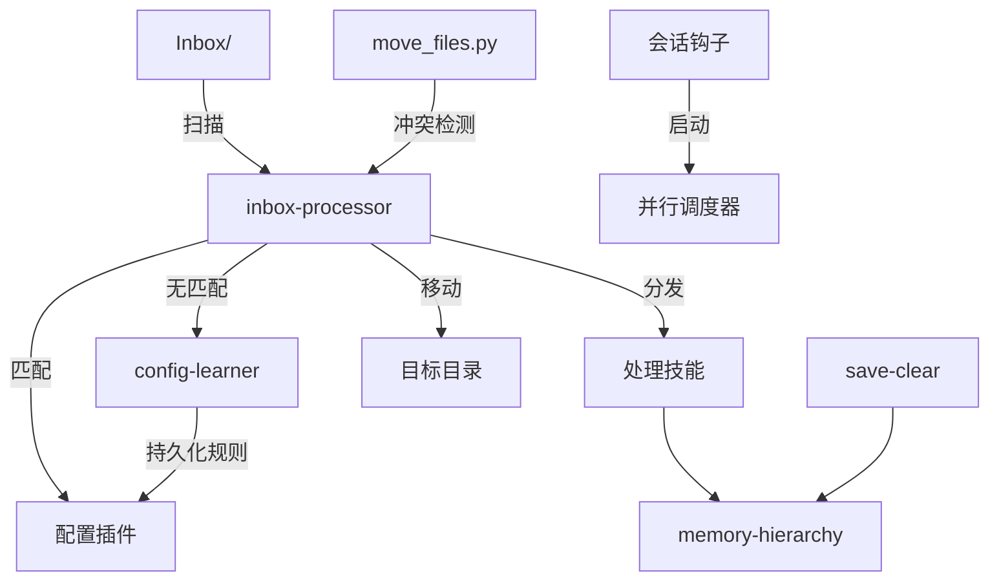

# AgentKit

基于配置驱动的 [Claude Code](https://claude.ai/claude-code) 技能框架 — 智能文件路由、自学习规则、结构化记忆、会话生命周期管理。

```
Inbox/ → [inbox-processor] → 匹配插件 → 分发/移动 → 清理
                ↓ 无匹配
         [config-learner] → 持久化新规则 → 下次自动匹配
```

## 功能概览

AgentKit 提供一组可复用的 **skills**（基于 prompt 的能力模块），将你的知识库变成自动化的知识管理系统：

- **inbox-processor** — 配置驱动的文件路由器。文件放入 `Inbox/`，插件按文件名、正则、扩展名或内容特征匹配，然后分发到处理技能或移动到目标目录。
- **config-learner** — 运行时规则学习。当 inbox 遇到未知文件时，问你一次，然后永久记住这个规则。
- **memory-hierarchy** — 结构化记忆管理。扫描日记/收件箱中的待办，维护决策、偏好、教训和项目记录，支持语义去重。
- **save-clear** — 会话生命周期。清除上下文前导出对话到知识库，自动提取记忆。

另外包含可复用的 **agent 模板**（researcher, coder, checker）和**会话钩子**。

## 架构



### 设计模式

| 模式 | 位置 | 说明 |
|------|------|------|
| **配置驱动路由** | inbox-processor | JSON 插件，带优先级、匹配条件、动作 |
| **自学习** | config-learner | 用户决策自动持久化为新插件规则 |
| **冲突感知文件操作** | move_files.py | 自动解决重复/超集，标记分歧内容 |
| **结构化记忆** | memory-hierarchy | 原子化条目 + 语义去重 |
| **会话生命周期** | hooks/ | 并行启动脚本、对话导出 |

详见 [ARCHITECTURE.md](ARCHITECTURE.md)。

## 快速开始

```bash
# 1. 克隆
git clone https://github.com/youruser/agentkit.git
cd agentkit

# 2. 安装
chmod +x setup.sh
./setup.sh

# 3. 测试 — 放一个文件到 vault 的 Inbox/，然后在 Claude Code 中运行：
/inbox-processor
```

安装脚本会：
- 询问你的知识库路径
- 将 skills 软链接到 `~/.claude/skills/`
- 从示例创建配置文件
- 可选安装 agent 模板和钩子

## 插件系统

插件是 JSON 对象，定义文件如何被匹配和路由：

```json
{
  "name": "meeting-notes",
  "priority": 20,
  "filename_regex": "\\d{4}-\\d{2}-\\d{2}.*meeting",
  "extension": [".md"],
  "content_hints": ["attendees", "action items", "agenda"],
  "tags": ["meetings"],
  "move_to": "Meetings/"
}
```

**匹配逻辑**（短路求值，首个匹配生效）：
1. `filename_contains` → 关键词匹配（快速路径）
2. `filename_regex` → 文件名正则
3. `extension` → 文件类型过滤
4. `content_hints` → OCR 图片、读取 PDF/markdown 内容

**动作**：`move_to`（文件路由）、`handler_skill`（调用其他技能）、`actions` 数组（多步骤）。

预置配置见 [examples/inbox-plugins/](examples/inbox-plugins/)。

## 项目结构

```
agentkit/
├── _shared/                    # 共享基础设施
│   ├── user_config.py          # 三层配置加载器
│   ├── move_files.py           # 冲突感知文件移动器
│   └── moc_builder.py          # MOC 生成器
├── skills/                     # 核心技能
│   ├── inbox-processor/        # 文件路由引擎
│   ├── config-learner/         # 运行时规则学习
│   ├── memory-hierarchy/       # 结构化记忆
│   └── save-clear/             # 会话导出 + 记忆更新
├── agents/                     # Agent 模板
│   ├── researcher.md           # 专注研究
│   ├── coder.md                # TDD 实现
│   └── checker.md              # 代码审查（只读）
├── hooks/                      # 会话生命周期
│   └── session-start-dispatcher.py
├── examples/                   # 预置配置
└── docs/                       # 文档
```

## 配置

三层配置解析（每层覆盖前一层）：

1. **框架默认值** — `_shared/user_config.py` 中的 `DEFAULT_CONFIG`
2. **用户配置** — `_shared/user-config.json`（gitignored，从示例创建）
3. **本地覆盖** — `_shared/user-config.local.json`（机器级别）

## 环境要求

- [Claude Code](https://claude.ai/claude-code) CLI 或桌面应用
- Python 3.10+
- 知识库目录（如 Obsidian vault 或任何目录结构）

## 许可证

MIT — 见 [LICENSE](LICENSE)。
