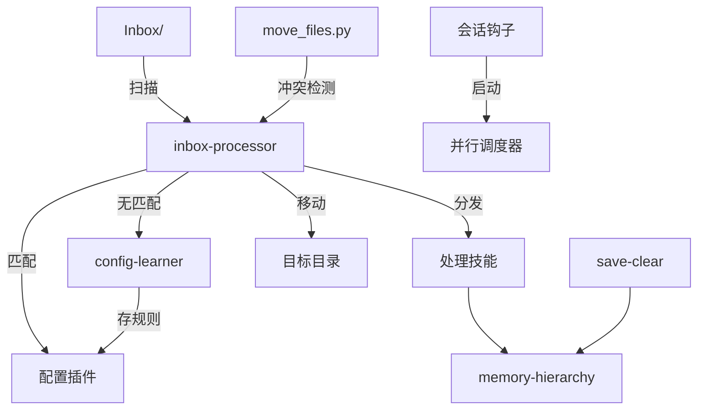

# AgentKit

给 [Claude Code](https://claude.ai/claude-code) 用的文件路由系统。你教它一次，它就记住了。

```
Inbox/ → [inbox-processor] → 匹配插件 → 分发/移动 → 清理
                ↓ 无匹配
         问你一次 → [config-learner] → 存规则 → 下次自动处理
```

## 为什么做这个

我每天往知识库里丢很多东西 — 口播录音转写、截图、PDF、随手写的笔记。全部堆在 `Inbox/` 里，不整理就越攒越多。

所以我搭了一套系统：文件丢进去，跑一个命令，各归各位。碰到没见过的东西，它会问我怎么处理，然后把规则记下来。用了两周之后，95% 以上的文件都是自动归档的。

核心想法很简单：**同一类文件你不应该分类两次**。告诉系统一次，后面它自己搞定。

这个东西是从我每天用 Claude Code 的工作流里长出来的 — 我需要一个越用越聪明的系统，不是一个写死的脚本。整个架构是配置驱动的，你可以根据自己的工作流去调整。

## 里面有什么

- **inbox-processor** — 核心。扫描 Inbox，按插件规则匹配文件（文件名、正则、扩展名、内容关键词），然后移动或交给其他 skill 处理。图片会 OCR，docx/xlsx/pptx 会提取文本。
- **config-learner** — inbox 碰到不认识的文件时，你告诉它怎么处理，它把规则写进 config.json。同样的问题不会问第二遍。
- **memory-hierarchy** — 跨 session 维护你的决策、教训、待办。扫描日记和 Inbox 提取新条目，自动去重。
- **save-clear** — 清 context 之前把对话导出到知识库，顺便提取值得记住的决策和教训。

另外还有 **agent 模板**（researcher、coder、checker）和**会话钩子**。

## 架构



### 各部分怎么配合

| 模式 | 在哪 | 干什么 |
|------|------|--------|
| **配置驱动路由** | inbox-processor | JSON 插件，按优先级匹配，匹配到就执行动作 |
| **自学习** | config-learner | 你的决策自动变成新规则 |
| **冲突感知** | move_files.py | 自动处理重复和超集，真正冲突才问你 |
| **结构化记忆** | memory-hierarchy | 原子化条目，语义去重，只追加不覆盖 |
| **会话生命周期** | hooks/ | 并行启动脚本，对话导出 |

更多细节见 [ARCHITECTURE.md](ARCHITECTURE.md)。

## 快速开始

```bash
git clone https://github.com/VanK33/Knowledge-Base-Kit.git
cd Knowledge-Base-Kit
chmod +x setup.sh
./setup.sh
```

安装脚本会问你知识库路径，把 skills 软链接到 `~/.claude/skills/`，从示例创建配置文件。

然后往 Inbox 丢一个文件，在 Claude Code 里跑 `/inbox-processor`。

## 实际跑起来是什么样

假设你的 Inbox 里有三个文件：
- `2026-03-30-standup.md` — `filename_regex` 命中 → 移到 `Meetings/`
- `Q1-report.pdf` — `content_hints` 在内容里找到 "quarterly revenue" → 移到 `Reports/`
- `random-screenshot.png` — 没匹配上 → OCR 读图，还是没匹配 → 问你 → 你说 "Screenshots/" → config-learner 存规则

下次再来类似的截图，直接就到 `Screenshots/` 了。

## 插件系统

插件就是 JSON，长这样：

```json
{
  "name": "meeting-notes",
  "priority": 20,
  "filename_regex": "\\d{4}-\\d{2}-\\d{2}.*meeting",
  "extension": [".md"],
  "content_hints": ["attendees", "action items", "agenda"],
  "move_to": "Meetings/"
}
```

匹配逻辑是短路的，第一个匹配到就停：
1. `filename_contains` → 文件名里有没有关键词
2. `filename_regex` → 正则匹配文件名
3. `extension` → 文件类型过滤
4. `content_hints` → 真的去读文件内容（图片 OCR，Office 文件提取文本）

你可以手写插件，也可以让 config-learner 在你用的过程中自动帮你建。

预置配置在这：[examples/inbox-plugins/](examples/inbox-plugins/)

## 项目结构

```
agentkit/
├── _shared/                    # 共享基础设施
│   ├── user_config.py          # 三层配置加载器
│   ├── move_files.py           # 冲突感知文件移动
│   ├── extract_text.py         # 文本提取（docx/xlsx/pptx）
│   └── moc_builder.py          # 目录索引生成器
├── skills/                     # 核心 skills
│   ├── inbox-processor/        # 文件路由引擎
│   ├── config-learner/         # 运行时规则学习
│   ├── memory-hierarchy/       # 结构化记忆
│   └── save-clear/             # 会话导出 + 记忆更新
├── agents/                     # Agent 模板
├── hooks/                      # 会话生命周期
├── examples/                   # 预置配置
└── docs/                       # 文档
```

## 配置

三层，后面的覆盖前面的：

1. **默认值** — `user_config.py` 里写死的，开箱能用
2. **你的配置** — `user-config.json`，你的路径、你的偏好
3. **本地覆盖** — `user-config.local.json`，公司电脑和家里电脑路径不一样的时候用

```json
{
  "paths": {
    "vault_root": "~/MyKnowledgeBase",
    "inbox_folder": "Inbox"
  },
  "automation": {
    "auto_refresh_indexes": true,
    "git_commit": false
  }
}
```

## 文档

- [Getting Started](docs/getting-started.md) — 安装到跑第一次 inbox
- [Config Reference](docs/config-reference.md) — 每个配置项的说明
- [Writing Custom Plugins](docs/writing-custom-plugins.md) — 插件 schema 和匹配逻辑
- [Skill Development Guide](docs/skill-development-guide.md) — 怎么写自己的 skill

## 环境要求

- [Claude Code](https://claude.ai/claude-code)
- Python 3.10+
- 一个你想整理的目录（Obsidian vault、普通文件夹、随便什么都行）

## License

MIT
